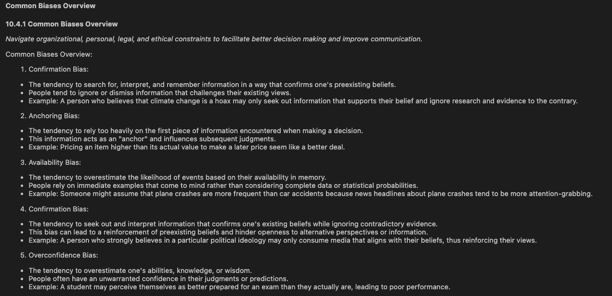

# GPT Note Taker

## Introduction

The GPT Note Taker is a tailored notebook designed for efficient note-taking for UC Berkeley's Data Science 201 course, leveraging the power of OpenAI's GPT models.

I discussed the creation/usage of this notebook with my lecturer, he approved of it and encouraged that I share it with others. However, the use of GPT in the context of education can be controversial, so please use this notebook at your own discretion.

## Requirements

- Python 3
- External Python libraries:
  - PyPDF2: For PDF manipulation.
  - openai: To interface with the OpenAI API.
  - IPython: For displaying outputs in a notebook format.

To install these libraries use the following command:

```
pip install -r requirements.txt
```

## Setup & Instructions

1. Register at OpenAI and create a ChatGPT API key [here](https://platform.openai.com/account/api-keys).
2. Add a credit card.  
   Each API call costs a few cents. (Example: Running 7 transcripts and testing costs about 5 cents total.)
3. Create a keys.json file in the root directory and input your OpenAI keys.  
   Format of keys.json file:

```
{
"organization_key": "org-YOUR-KEY-HERE",
"api_key": "sk-YOUR-KEY-HERE"
}
```

4. Rename your PDF file appropriately.
5. Update the prompt section to match your desired note-taking format.
6. Execute the notebook.

## Usage

### Example Prompt

```
f"""Topic: {section.title}
    Detail Level: I would like something between high-level summary and detailed notes.
    Learning Objectives: {'; '.join(section.lo)}
    Format: I prefer the notes to be in bullet-point or table format.
    Course Transcript: {section.text}
    Purpose: The notes are for my personal understanding and to facilitate in class discussion with my peers."""
```

I asked ChatGPT what inputs it needs to be successful in creating the notes. Then I modified it slightly to fit my needs. I would recommend modifying the prompt to fit your needs as well.

### Example Output



## Disclaimer

While this tool can enhance your note-taking experience, it's crucial to use it responsibly, especially in academic settings. Ensure you adhere to all academic integrity guidelines and any other applicable ethics principles when utilizing this notebook.

## Contributing

Feel free to open issues for bugs or suggestions. If you want to contribute directly, open a pull request with your changes.
